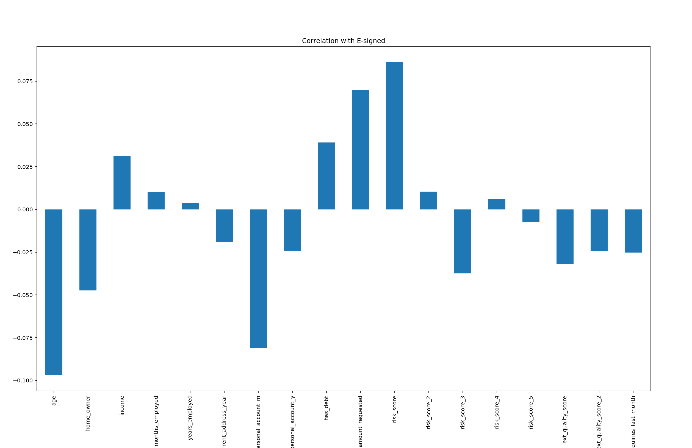
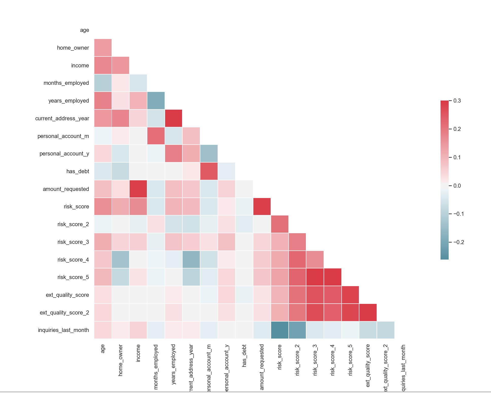
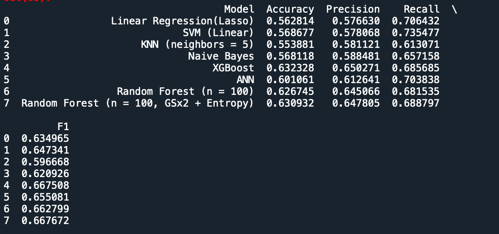

# Loan-Probability-Analysis - ReadMe in progress
E-signing a loan based on Financial History Probability Analysis

__A logistic regression machine learning model that explores the likelyhood of loan applicants that will go through with the final E-signing phase based on their financial data - 63% accuracy__

## EDA
The initiation phase of the project starts with data cleaning and visualization <br />
To do that we first need to import the necessary libraries 

```python
import pandas as pd
import numpy as np
import seaborn as sns
import matplotlib.pyplot as plt
%matplotlib qt
```
read the Financial_Data.csv file and get a better idea of what kind of data we are dealing with by using :<br />

dataset = pd.read_csv('Financial_Data.csv') 
dataset.describe()


We then clean up the data a bit by looking for any N/A data in our columns<br />

```python
dataset.isna().any()
```

Fortunate for us, the data-set we have is clean and contains no N/A data.<br />

### Graph Analysis

Moving on, we will generate a list of Histograms of known variables to see if we can find any patterns, <br />
To do this we first need to drop columns containing identifiers or dependent variables. <br />

dataset2 = dataset.drop(columns = ['entry_id', 'pay_schedule', 'e_signed']) <br />

With all the columns preped, we can generate a grid of histograms

```python
fig = plt.figure(figsize = (15,12))
plt.suptitle('Histogram of Numerical Columns')
for i in range (dataset2.shape[1]):
    plt.subplot(6,3,i+1)
    f = plt.gca()
    f.set_title(dataset2.columns.values[i])
    
    val = np.size(dataset2.iloc[:,i].unique())
    if val >= 100:
        val = 100
        
    plt.hist(dataset2.iloc[:,i], bins = val)
plt.tight_layout(rect = [0,0.1,1,0.9])

```


Here find a lot of valuable information, let's break down the variables that stood out:<br />

Variable Analysis: <br />

1. **Age** - The majority of loan applicants are bettween the ages of 30 and 50. <br />
2. **Home Owner** - There are less home owners than there are none-home owners. <br />
3. **Income** - The income of this group of loan applicants lies between 15k to 60k with incriments of ~5k. <br />
4. **Years Employed** - Most of the applicants had worked less than 7 years. <br />
5. **Personal Account(Year)** - Most of the loan applicants have accounts for fewer than 4 years. A small bump in numbers of applicants with 6 year old accounts.<br />
6. **Has Debt** - A very large majority of applicants have debts. <br />
7. **Amount Requested** - The amounts requested are mostly between 1k to 15k. <br />
8. **Risk Score** - The risk scores are in the 60k region. <br />
9. **Inquires Last Month** - Inquires within the last month were between 2 to 10. <br />

### Analysis

We have a very interesting data set. The applicants are mostly in their prime age between 30 to fifty, but the majority had been employed for fewer than 6 years. It's uncertain, however, whether the data is showing the total years of employment or just the current position. We don't know what type of loan application the data represents, but we can rule out some major loans such as housing morgage or business loans simply from the amounts requested. The stability of these applicants can be a bit concerning due to the fact that more than half are not home owners, and have lived in the current address for less than 3 years. All the applicants have debt, but the amounts owed are unknown. Inquires since last month can be a subject of concern depending on the loan type as an average of 5 inquires within the span of a month is a potential indication of desperation, depending on the loan. Depends on how the data's collected, the length of personal accounts can also be a subject of concern as the average length of 3 years in a group of applicants averaging 40 years of age is quite miniscule. <br />
    
The information provided by the loan applicants showed that this loan is attracting people with above average risk, something that is indicated by the risk score. The goal of this analysis is to identify the likelyhood of applicants who will get to the e-sign stage and workout a strategy to get more people to sign off on the loan, therefore business should have already evaluated the potential risk associated with this group of applicants. If not, this analysis can be a good start for the optimization of the loan requirements.  <br />

### Correlation

Now let's take a look at the correlation between the data we just explored and their correlation with the dependent variable. <br />

```python
dataset2.corrwith(dataset.e_signed).plot.bar(
    title = 'Correlation with E-signed')
```

 

### Analysis

Age has strong inverse correlation with the result of whether the person passes the e-signning phase. This make sense as older adults can be more impatient and less likely to get to the e-signing page. The length of personal accounts, both in year and month are negative correlated with the results as well. Debt level, amounts requested and risk score are all positvely correlated with the dependent variable. These variables are potential signs of desperation, which makes sense for the loan applicants to get to the e-signing stage and sign off on a loan.<br />

***Correlation Matrix

Let's now take a closer look at the variables and how they correlate with one another by creating a correlation matrix. <br />
To do this, we need the following code

```python
#Correlation Matrix
sns.set(style = 'white')

corr = dataset2.corr()

mask = np.zeros_like(corr, dtype = np.bool)
mask[np.triu_indices_from(mask)] = True

f, ax = plt.subplots()

cmap = sns.diverging_palette(220,10,as_cmap = True)

sns.heatmap(corr,mask = mask, cmap = cmap, vmax = 0.3, center =0,
            square = True, linewidths = 0.5, cbar_kws = {"shrink": .5})
```

 


Few things from this correlation matrix that stood out. Amount requested is highly correlated with income, that means the more applicants made per month, the more likely they will request for a higher amount of loan. Years employed is strongly correlated with the current address year, and this makes sense because a persons likelyhood of moving while staying at the same job won't be too high. Amount requested is strongly correlated with loan applicants' risk scores, and the risk scores are correlated with one another. This also makes sense because if one of the risk scores is extremely high for an applicant, chances are the risk score from other categories for the same applicant won't be low. The correlation make sense, therefore no removal of fields is necessary.


### Construction of Models

Let's get the data ready for model building. <br />
We will use a seperate file for the modeling process. <br />

To start, we will import the codes and raw data.

```python
import numpy as np
import seaborn as sns
import matplotlib.pyplot as plt
import pandas as pd
%matplotlib qt


dataset = pd.read_csv('Financial_Data.csv') 
```


Next we want to manipulate the data containing dates by dropping the months employed and aggregate the length of personal accounts to the exact months <br />

```
dataset = dataset.drop(columns = 'months_employed')
dataset['personal_account_months'] = (dataset.personal_account_m + dataset.personal_account_y*12)

dataset[['personal_account_months',"personal_account_m","personal_account_y"]]

dataset = dataset.drop(columns = ['personal_account_m','personal_account_y'])
```

I did this because months employed data won't be useful to the analysis we perform later, and aggregating the years and months to just months makes the data set cleaner.<br />

With the dataset nice and clean, let's put in dummy variables!
```
dataset = pd.get_dummies(dataset,drop_first  = True)

response= dataset['e_signed']
user = dataset['entry_id']
dataset = dataset.drop(columns = ['e_signed','entry_id'])
```

Note here that I took out the e_signed as the dependent variable. I also took out entry_id that will be used as reference for data frame later.<br />

### Feature Scaling 

```
from sklearn.model_selection import train_test_split
x_train, x_test, y_train, y_test = train_test_split(dataset,response,test_size = .2, random_state = 0)

from sklearn.preprocessing import StandardScaler
sc = StandardScaler()

x_train1 = pd.DataFrame(sc.fit_transform(x_train))
x_test1 = pd.DataFrame(sc.transform(x_test))

x_train1.columns = x_train.columns.values
x_test1.columns = x_test.columns.values

x_train1.index = x_train.index.values
x_test1.index = x_test.index.values

x_train = x_train1
x_test = x_test1

del x_train1, x_test1
```

Here we split the data into training sets and test sets. We scale the data with StandardScaler.<br />
The newly scaled dataset doesn't carry-over the column headers, so to make it more readable we set the new scaled train & test data as data frames, then fit the column values from the unscaled data frame into the new data frame. <br />

### LogisticRegression

Now we have the data ready, it's time to build our models. We want to start off easy by using simple linear regression: <br />

```
from sklearn.linear_model import LogisticRegression
classifier = LogisticRegression(penalty= 'l1', random_state=0,solver='liblinear')
classifier.fit(x_train, y_train)

y_pred = classifier.predict(x_test)
from sklearn.metrics import accuracy_score, f1_score, precision_score, recall_score
acc = accuracy_score(y_test, y_pred)
prec = precision_score(y_test, y_pred)
rec = recall_score(y_test,y_pred)
f1 = f1_score(y_test,y_pred)

results = pd.DataFrame([['Linear Regression(Lasso)', acc, prec, rec, f1]],
             columns = ["Model", "Accuracy", "Precision", "Recall", "F1"])

```

Note that because we will be constructing different models, so instead of yielding one result per model, we created a data frame called results where we can append all the results based on the model name, the accuracy score, the precision score, the recall score and the f1 score. 

### SVM

```
from sklearn.svm import SVC
classifier = SVC(kernel = 'linear', random_state = 0)
classifier.fit(x_train, y_train)
y_pred = classifier.predict(x_test)

acc = accuracy_score(y_test, y_pred)
prec = precision_score(y_test, y_pred)
rec = recall_score(y_test,y_pred)
f1 = f1_score(y_test,y_pred)

model_results = pd.DataFrame([['SVM (Linear)', acc, prec, rec, f1]],
             columns = ["Model", "Accuracy", "Precision", "Recall", "F1"])
results = results.append(model_results,ignore_index = True)
```

### RBF
```
classifier = SVC(kernel = 'rbf', random_state = 0)
classifier.fit(x_train, y_train)
y_pred = classifier.predict(x_test)


acc = accuracy_score(y_test, y_pred)
prec = precision_score(y_test, y_pred)
rec = recall_score(y_test,y_pred)
f1 = f1_score(y_test,y_pred)

model_results = pd.DataFrame([['SVM (RBF)', acc, prec, rec, f1]],
             columns = ["Model", "Accuracy", "Precision", "Recall", "F1"])
results = results.append(model_results,ignore_index = True)
```

### KNN
```
from sklearn.neighbors import KNeighborsClassifier
classifier = KNeighborsClassifier(n_neighbors = 5, metric = 'minkowski', p = 2)
classifier.fit(x_train, y_train)

y_pred = classifier.predict(x_test)


acc = accuracy_score(y_test, y_pred)
prec = precision_score(y_test, y_pred)
rec = recall_score(y_test,y_pred)
f1 = f1_score(y_test,y_pred)

model_results = pd.DataFrame([['KNN (neighbors = 5)', acc, prec, rec, f1]],
             columns = ["Model", "Accuracy", "Precision", "Recall", "F1"])
results = results.append(model_results,ignore_index = True)
```

### Naive
```
from sklearn.naive_bayes import GaussianNB
classifier = GaussianNB()
classifier.fit(x_train,y_train)

y_pred = classifier.predict(x_test)

acc = accuracy_score(y_test, y_pred)
prec = precision_score(y_test, y_pred)
rec = recall_score(y_test,y_pred)
f1 = f1_score(y_test,y_pred)

model_results = pd.DataFrame([['Naive Bayes', acc, prec, rec, f1]],
             columns = ["Model", "Accuracy", "Precision", "Recall", "F1"])
results = results.append(model_results,ignore_index = True)
```

### Random Forest
```
from sklearn.ensemble import RandomForestClassifier
classifier = RandomForestClassifier(n_estimators = 100, criterion = 'entropy', random_state = 0)
classifier.fit(x_train, y_train)

y_pred = classifier.predict(x_test)

acc = accuracy_score(y_test, y_pred)
prec = precision_score(y_test, y_pred)
rec = recall_score(y_test,y_pred)
f1 = f1_score(y_test,y_pred)

model_results = pd.DataFrame([['Random Forest (n = 100)', acc, prec, rec, f1]],
             columns = ["Model", "Accuracy", "Precision", "Recall", "F1"])
results = results.append(model_results,ignore_index = True)
```

#### Grid Search
```
parameters = {'max_depth': [None],
              'max_features': [3,5,7],
              'min_samples_split': [8,10,12],
              'min_samples_leaf': [1,2,3],
              'bootstrap': [True],
              'criterion': ['entropy']
              }

from sklearn.model_selection import GridSearchCV
grid_search = GridSearchCV(estimator = classifier,
                           param_grid = parameters,
                           scoring = 'accuracy',
                           cv = 10,
                           n_jobs = -1)


grid_search = grid_search.fit(x_train, y_train)

rf_best_accuracy = grid_search.best_score_
rf_best_parameters = grid_search.best_params_
rf_best_accuracy, rf_best_parameters

## Fitting the model with the *best* parameters

y_pred = grid_search.predict(x_test)


acc = accuracy_score(y_test, y_pred)
prec = precision_score(y_test, y_pred)
rec = recall_score(y_test,y_pred)
f1 = f1_score(y_test,y_pred)

model_results = pd.DataFrame([['Random Forest (n = 100, GSx2 + Entropy)', acc, prec, rec, f1]],
             columns = ["Model", "Accuracy", "Precision", "Recall", "F1"])
results = results.append(model_results,ignore_index = True)
```


### XGBoost
```
from xgboost import XGBClassifier
classifier = XGBClassifier()
classifier.fit(x_train, y_train)

y_pred = classifier.predict(x_test)


acc = accuracy_score(y_test, y_pred)
prec = precision_score(y_test, y_pred)
rec = recall_score(y_test,y_pred)
f1 = f1_score(y_test,y_pred)


model_results = pd.DataFrame([['XGBoost', acc, prec, rec, f1]],
             columns = ["Model", "Accuracy", "Precision", "Recall", "F1"])
results = results.append(model_results,ignore_index = True)
```


### ANN
```
import keras
from keras.models import Sequential
from keras.layers import Dense

classifier = Sequential()

classifier.add(Dense(units= 9, kernel_initializer = 'uniform', activation = 'relu', input_dim = 19))
classifier.add(Dense(units= 9, kernel_initializer = 'uniform', activation = 'relu'))
classifier.add(Dense(units= 1, kernel_initializer = 'uniform', activation = 'sigmoid'))

classifier.compile(optimizer = 'adam', loss = 'binary_crossentropy', metrics = ['accuracy'])

classifier.fit(x_train,y_train, batch_size= 10, nb_epoch=100)


y_pred = classifier.predict(x_test)
y_pred = (y_pred>0.5)


acc = accuracy_score(y_test, y_pred)
prec = precision_score(y_test, y_pred)
rec = recall_score(y_test,y_pred)
f1 = f1_score(y_test,y_pred)


model_results = pd.DataFrame([['ANN', acc, prec, rec, f1]],
             columns = ["Model", "Accuracy", "Precision", "Recall", "F1"])
results = results.append(model_results,ignore_index = True)
```

## Final Results
```
pd.set_option('display.max_columns', None)
results
```
 

As we can see in the results that XGBoost has the highest accuracy score, second by the Random Forest optimized by grid search. XGBoost also has the highest precision score. This is to be expected as XGBoost is one of the more effective tools currently around for data processing. We see that ANN has the highest recall score, and both Random Forest & XGBoost ties the highest F1 score. Overall, the most accurate model to use here is XGBoost. It was also a lot easier to impliment as the lines required for the code is quite minimal. 


