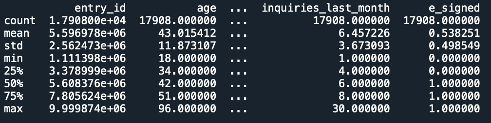
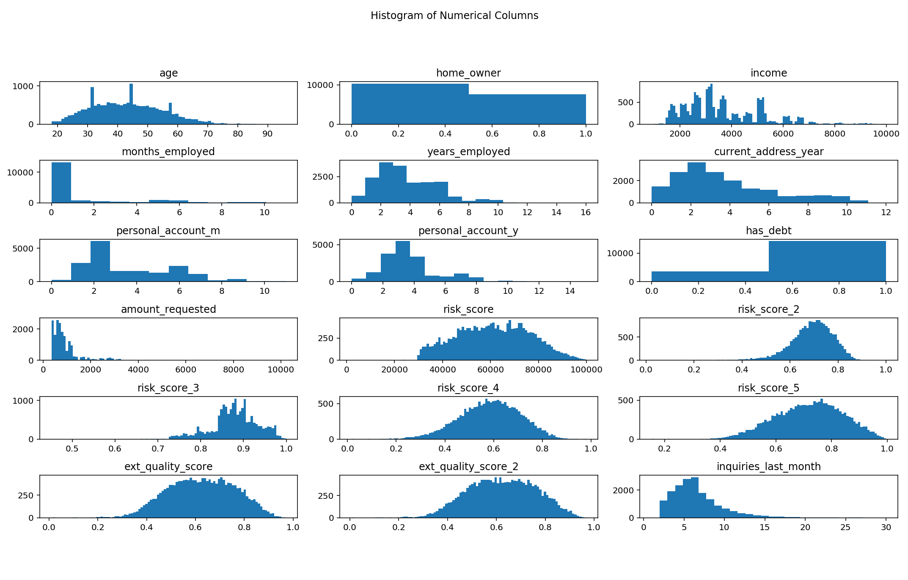
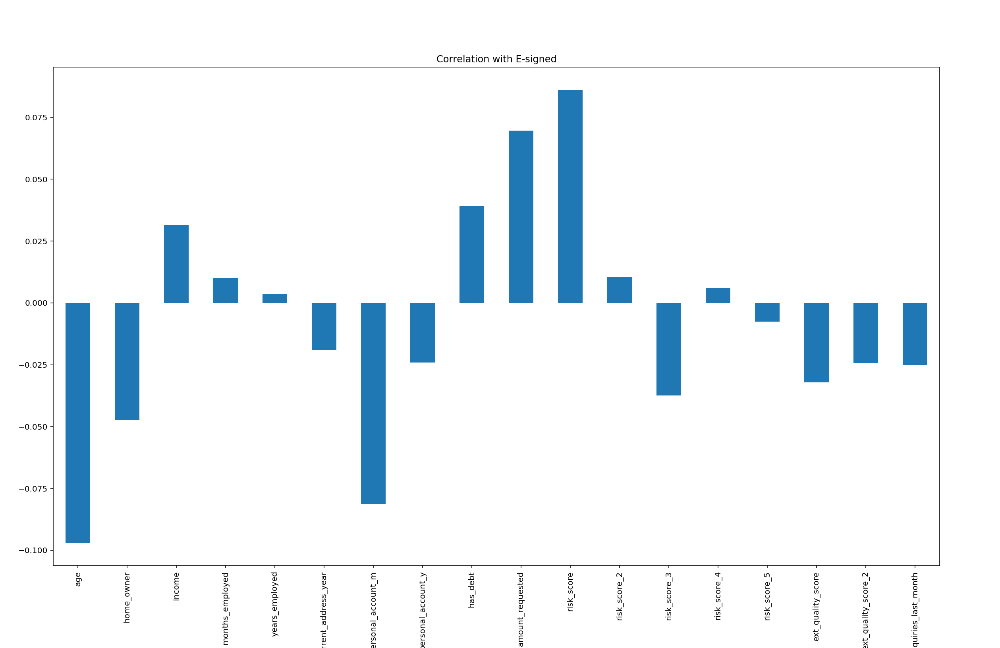

# Loan-Probability-Analysis
E-signing a loan based on Financial History Probability Analysis

__A logistic regression machine learning model that explores the likelyhood of loan applicants that will go through with the final E-signing phase based on their financial data - 63% accuracy__

## EDA
The initiation phase of the project starts with data cleaning and visualization <br />
To do that we first need to import the necessary libraries 

```python
import pandas as pd
import numpy as np
import seaborn as sns
import matplotlib.pyplot as plt
%matplotlib qt
```
read the Financial_Data.csv file and get a better idea of what kind of data we are dealing with by using :<br />

dataset = pd.read_csv('Financial_Data.csv') 
dataset.describe()




We then clean up the data a bit by looking for any N/A data in our columns<br />

```python
dataset.isna().any()
```

Fortunate for us, the data-set we have is clean and contains no N/A data.<br />

Moving on, we will generate a list of Histograms of known variables to see if we can find any patterns, <br />
To do this we first need to drop columns containing identifiers or dependent variables. <br />

dataset2 = dataset.drop(columns = ['entry_id', 'pay_schedule', 'e_signed']) <br />

With all the columns preped, we can generate a grid of histograms

```python
fig = plt.figure(figsize = (15,12))
plt.suptitle('Histogram of Numerical Columns')
for i in range (dataset2.shape[1]):
    plt.subplot(6,3,i+1)
    f = plt.gca()
    f.set_title(dataset2.columns.values[i])
    
    val = np.size(dataset2.iloc[:,i].unique())
    if val >= 100:
        val = 100
        
    plt.hist(dataset2.iloc[:,i], bins = val)
plt.tight_layout(rect = [0,0.1,1,0.9])

```



Here find a lot of valuable information, let's break down the variables that stood out:<br />

**Age** - The majority of loan applicants are bettween the ages of 30 and 50. <br />
**Home Owner** - There are less home owners than there are none-home owners. <br />
**Income** - The income of this group of loan applicants lies between 15k to 60k with incriments of ~5k. <br />
**Years Employed** - Most of the applicants had worked less than 7 years. <br />
**Personal Account(Year)** - Most of the loan applicants have accounts for fewer than 4 years. A small bump in numbers of applicants with 6 year old accounts.<br />
**Has Debt** - A very large majority of applicants have debts. <br />
**Amount Requested** - The amounts requested are mostly between 1k to 15k. <br />
**Risk Score** - The risk scores are in the 60k region. <br />
**Inquires Last Month** - Inquires within the last month were between 2 to 10. <br />

We have a very interesting data set. The applicants are mostly in their prime age between 30 to fifty, but the majority had been employed for fewer than 6 years. It's uncertain, however, whether the data is showing the total years of employment or just the current position. We don't know what type of loan application the data represents, but we can rule out some major loans such as housing morgage or business loans simply from the amounts requested. The stability of these applicants can be a bit concerning due to the fact that more than half are not home owners, and have lived in the current address for less than 3 years. All the applicants have debt, but the amounts owed are unknown. Inquires since last month can be a subject of concern depending on the loan type as an average of 5 inquires within the span of a month is a potential indication of desperation, depending on the loan. Depends on how the data's collected, the length of personal accounts can also be a subject of concern as the average length of 3 years in a group of applicants averaging 40 years of age is quite miniscule. <br />

The information provided by the loan applicants showed that this loan is attracting people with above average risk, something that is indicated by the risk score. The goal of this analysis is to identify the likelyhood of applicants who will get to the e-sign stage and workout a strategy to get more people to sign off on the loan, therefore business should have already evaluated the potential risk associated with this group of applicants. If not, this analysis can be a good start for the optimization of the loan requirements.  <br />

Now let's take a look at the correlation between the data we just explored and their correlation with the dependent variable. <br />

```python
dataset2.corrwith(dataset.e_signed).plot.bar(
    title = 'Correlation with E-signed')
```



Age has strong inverse correlation with the result of whether the person passes the e-signning phase. This make sense as older adults can be more impatient and less likely to get to the e-signing page. The length of personal accounts, both in year and month are negative correlated with the results as well. Debt level, amounts requested and risk score are all positvely correlated with the dependent variable. These variables are potential signs of desperation, which makes sense for the loan applicants to get to the e-signing stage and sign off on a loan.


